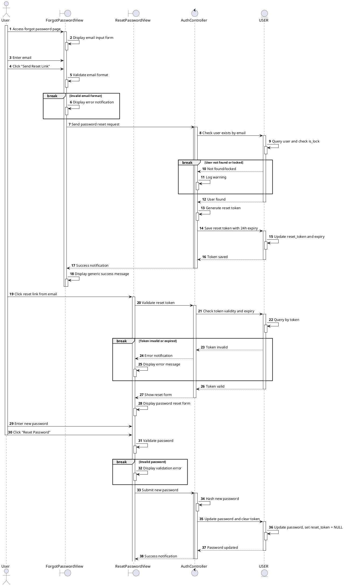

# Sequence Forgot Password

```plantuml
@startuml
autonumber

actor User as U
boundary ForgotPasswordView as FPV
boundary ResetPasswordView as RPV
control AuthController as AC
entity USER as US

activate U
U -> FPV: Access forgot password page
activate FPV
FPV -> FPV: Display email input form
activate FPV
deactivate FPV

U -> FPV: Enter email
U -> FPV: Click "Send Reset Link"
FPV -> FPV: Validate email format
activate FPV
deactivate FPV

break Invalid email format
  FPV -> FPV: Display error notification
  activate FPV
  deactivate FPV
end

FPV -> AC: Send password reset request
activate AC
activate AC
AC -> US: Check user exists by email
activate US
US -> US: Query user and check is_lock
activate US
deactivate US

break User not found or locked
  AC <-- US: Not found/locked
  AC -> AC: Log warning
  activate AC
  deactivate AC
end

AC <-- US: User found
deactivate US

AC -> AC: Generate reset token
activate AC
deactivate AC
AC -> US: Save reset token with 24h expiry
activate US
US -> US: Update reset_token and expiry
activate US
deactivate US
AC <-- US: Token saved
deactivate US

FPV <-- AC: Success notification
deactivate AC
deactivate AC
FPV -> FPV: Display generic success message
activate FPV
deactivate FPV
deactivate FPV

U -> RPV: Click reset link from email
activate RPV
RPV -> AC: Validate reset token
activate AC
AC -> US: Check token validity and expiry
activate US
US -> US: Query by token
activate US
deactivate US

break Token invalid or expired
  AC <-- US: Token invalid
  RPV <-- AC: Error notification
  RPV -> RPV: Display error message
  activate RPV
  deactivate RPV
end

AC <-- US: Token valid
deactivate US

RPV <-- AC: Show reset form
deactivate AC
RPV -> RPV: Display password reset form
activate RPV
deactivate RPV

U -> RPV: Enter new password
U -> RPV: Click "Reset Password"
deactivate U
RPV -> RPV: Validate password
activate RPV
deactivate RPV

break Invalid password
  RPV -> RPV: Display validation error
  activate RPV
  deactivate RPV
end

RPV -> AC: Submit new password
activate AC
activate AC
AC -> AC: Hash new password
activate AC
deactivate AC
AC -> US: Update password and clear token
activate US
US -> US: Update password, set reset_token = NULL
activate US
deactivate US
AC <-- US: Password updated
deactivate US

RPV <-- AC: Success notification
deactivate AC
deactivate AC


@enduml
```

<!-- diagram id="sequence-auth-forgot-password" -->
