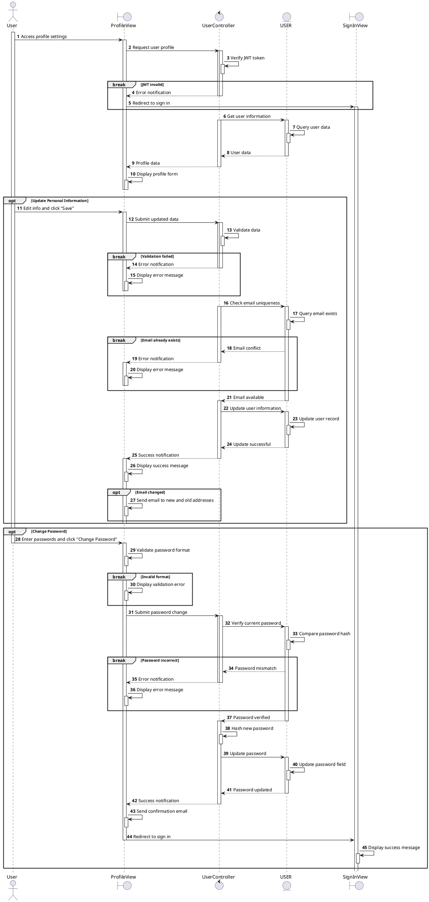

# Sequence Manage Profile

```plantuml
@startuml
autonumber

actor User as U
boundary ProfileView as PV
control UserController as UC
entity USER as US
boundary SignInView as SIV

activate U
U -> PV: Access profile settings
activate PV
PV -> UC: Request user profile
activate UC
activate UC
UC -> UC: Verify JWT token
activate UC
deactivate UC

break JWT invalid
  PV <-- UC: Error notification
  deactivate UC
  deactivate UC
  PV -> SIV: Redirect to sign in
  activate SIV
end

UC -> US: Get user information
activate US
activate UC
US -> US: Query user data
activate US
deactivate US
UC <-- US: User data
deactivate US

PV <-- UC: Profile data
deactivate UC
deactivate UC
PV -> PV: Display profile form
activate PV
deactivate PV
deactivate PV

opt Update Personal Information
  U -> PV: Edit info and click "Save"
  activate PV
  PV -> UC: Submit updated data
  activate UC
  activate UC
  UC -> UC: Validate data
  activate UC
  deactivate UC

  break Validation failed
    PV <-- UC: Error notification
    deactivate UC
    deactivate UC
    PV -> PV: Display error message
    activate PV
    deactivate PV
    deactivate PV
  end

  UC -> US: Check email uniqueness
  activate US
  activate UC
  US -> US: Query email exists
  activate US
  deactivate US

  break Email already exists
    UC <-- US: Email conflict
    PV <-- UC: Error notification
    deactivate UC
    activate PV
    PV -> PV: Display error message
    activate PV
    deactivate PV
    deactivate PV
  end

  UC <-- US: Email available
  deactivate US
  activate UC

  UC -> US: Update user information
  activate US
  US -> US: Update user record
  activate US
  deactivate US
  UC <-- US: Update successful
  deactivate US

  PV <-- UC: Success notification
  deactivate UC
  deactivate UC
  activate PV
  PV -> PV: Display success message
  activate PV
  deactivate PV

  opt Email changed
    PV -> PV: Send email to new and old addresses
    activate PV
    deactivate PV
  end

  deactivate PV
end

opt Change Password
  U -> PV: Enter passwords and click "Change Password"
  deactivate U
  activate PV
  PV -> PV: Validate password format
  activate PV
  deactivate PV

  break Invalid format
    PV -> PV: Display validation error
    activate PV
    deactivate PV
  end

  PV -> UC: Submit password change
  activate UC
  activate UC
  UC -> US: Verify current password
  activate US
  US -> US: Compare password hash
  activate US
  deactivate US

  break Password incorrect
    UC <-- US: Password mismatch
    PV <-- UC: Error notification
    deactivate UC
    deactivate UC
    PV -> PV: Display error message
    activate PV
    deactivate PV
  end

  UC <-- US: Password verified
  deactivate US
  activate UC

  UC -> UC: Hash new password
  activate UC
  deactivate UC
  UC -> US: Update password
  activate US
  US -> US: Update password field
  activate US
  deactivate US
  UC <-- US: Password updated
  deactivate US

  PV <-- UC: Success notification
  deactivate UC
  deactivate UC
  PV -> PV: Send confirmation email
  activate PV
  deactivate PV
  PV -> SIV: Redirect to sign in
  deactivate PV
  deactivate U
  SIV -> SIV: Display success message
  activate SIV
  deactivate SIV
end

@enduml
```

<!-- diagram id="sequence-auth-manage-profile" -->
