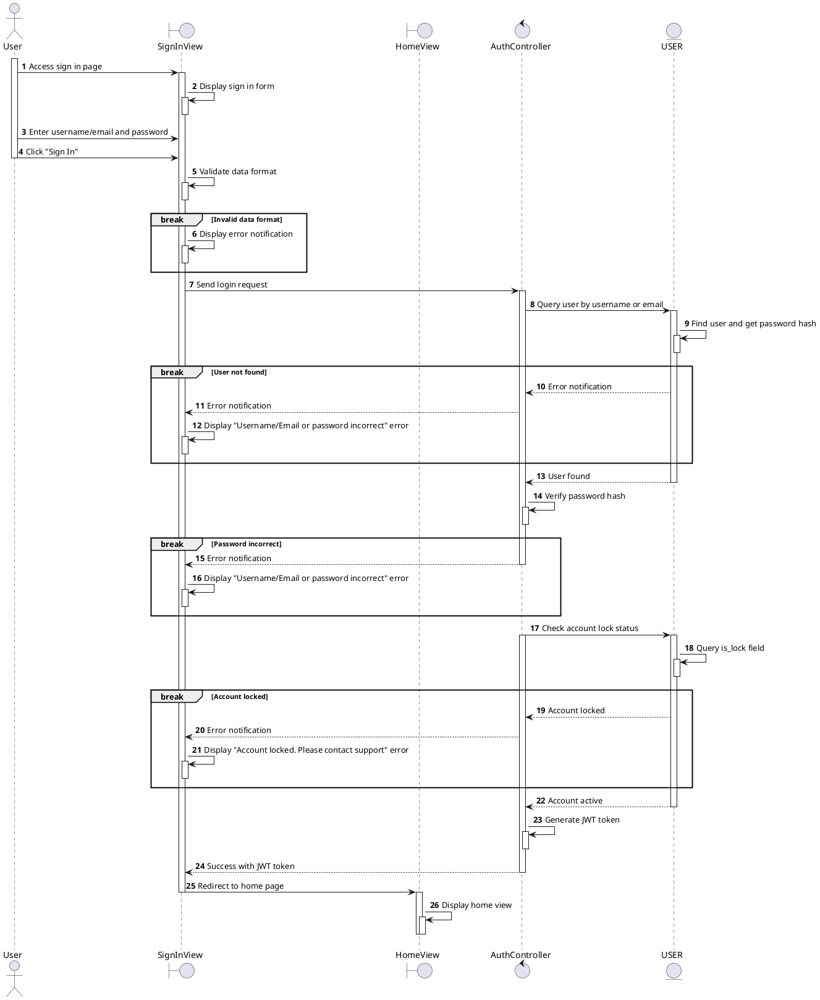

# Sequence Sign In

```plantuml
@startuml
autonumber

actor User as U
boundary SignInView as SIV
boundary HomeView as HV
control AuthController as AC
entity USER as US

activate U
U -> SIV: Access sign in page
activate SIV
SIV -> SIV: Display sign in form
activate SIV
deactivate SIV

U -> SIV: Enter username/email and password
U -> SIV: Click "Sign In"
deactivate U
SIV -> SIV: Validate data format
activate SIV
deactivate SIV

break Invalid data format
  SIV -> SIV: Display error notification
  activate SIV
  deactivate SIV
end

SIV -> AC: Send login request
activate AC
AC -> US: Query user by username or email
activate US
US -> US: Find user and get password hash
activate US
deactivate US

break User not found
  AC <-- US: Error notification
  SIV <-- AC: Error notification
  SIV -> SIV: Display "Username/Email or password incorrect" error
  activate SIV
  deactivate SIV
end

AC <-- US: User found
deactivate US

AC -> AC: Verify password hash
activate AC
deactivate AC

break Password incorrect
  SIV <-- AC: Error notification
  deactivate AC
  SIV -> SIV: Display "Username/Email or password incorrect" error
  activate SIV
  deactivate SIV
end

AC -> US: Check account lock status
activate US
activate AC
US -> US: Query is_lock field
activate US
deactivate US

break Account locked
  AC <-- US: Account locked
  SIV <-- AC: Error notification
  SIV -> SIV: Display "Account locked. Please contact support" error
  activate SIV
  deactivate SIV
end

AC <-- US: Account active
deactivate US
AC -> AC: Generate JWT token
activate AC
deactivate AC

SIV <-- AC: Success with JWT token
deactivate AC
deactivate AC
SIV -> HV: Redirect to home page
deactivate SIV
activate HV
HV -> HV: Display home view
activate HV
deactivate HV
deactivate HV

@enduml
```

<!-- diagram id="sequence-auth-sign-in" -->
