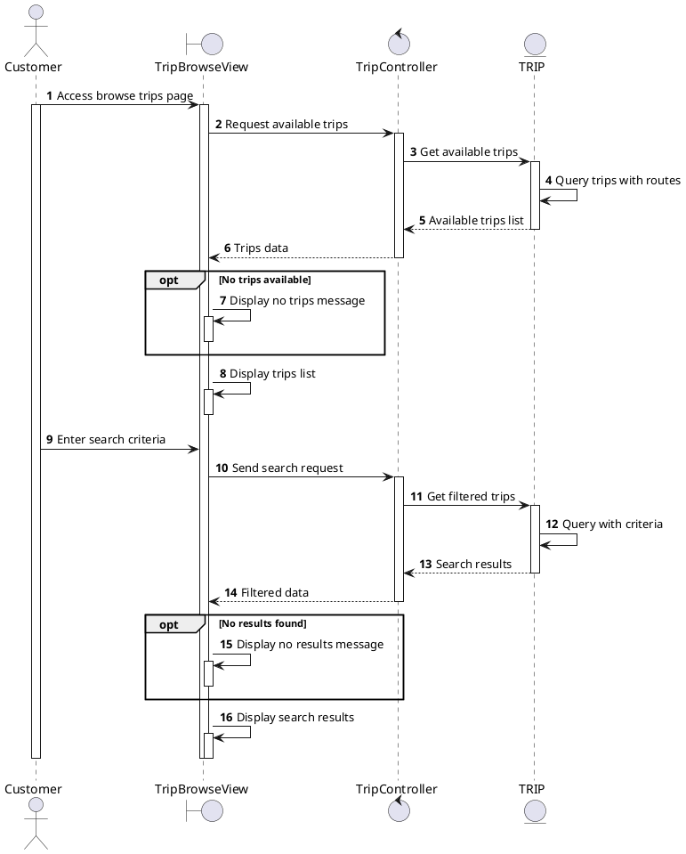

# Sequence View and Filter Available Trips

```plantuml
@startuml
autonumber

actor Customer as C
boundary TripBrowseView as TBV
control TripController as TC
entity TRIP as T

C -> TBV: Access browse trips page
activate C
activate TBV
TBV -> TC: Request available trips
activate TC
TC -> T: Get available trips
activate T
T -> T: Query trips with routes
TC <-- T: Available trips list
deactivate T
TBV <-- TC: Trips data
deactivate TC

opt No trips available
  TBV -> TBV: Display no trips message
  activate TBV
  deactivate TBV
end

TBV -> TBV: Display trips list
activate TBV
deactivate TBV

C -> TBV: Enter search criteria
TBV -> TC: Send search request
activate TC
TC -> T: Get filtered trips
activate T
T -> T: Query with criteria
TC <-- T: Search results
deactivate T
TBV <-- TC: Filtered data
deactivate TC

opt No results found
  TBV -> TBV: Display no results message
  activate TBV
  deactivate TBV
end

TBV -> TBV: Display search results
activate TBV
deactivate TBV

deactivate TBV
deactivate C

@enduml
```

<!-- diagram id="sequence-browse-trips-view-and-filter-available-trips" -->
