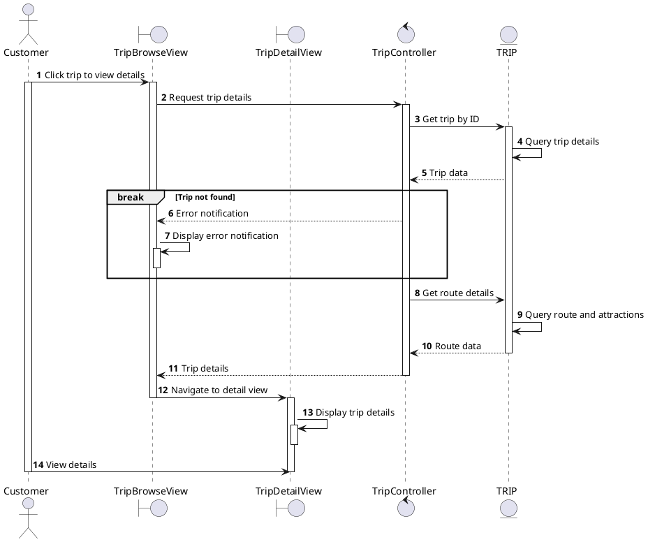

# Sequence View Trip Details

```plantuml
@startuml
autonumber

actor Customer as C
boundary TripBrowseView as TBV
boundary TripDetailView as TDV
control TripController as TC
entity TRIP as T

C -> TBV: Click trip to view details
activate C
activate TBV
TBV -> TC: Request trip details
activate TC
TC -> T: Get trip by ID
activate T
T -> T: Query trip details
TC <-- T: Trip data

break Trip not found
  TBV <-- TC: Error notification
  TBV -> TBV: Display error notification
  activate TBV
  deactivate TBV
end

TC -> T: Get route details
T -> T: Query route and attractions
TC <-- T: Route data
deactivate T
TBV <-- TC: Trip details
deactivate TC
TBV -> TDV: Navigate to detail view
deactivate TBV
activate TDV
TDV -> TDV: Display trip details
activate TDV
deactivate TDV

C -> TDV: View details
deactivate C
deactivate TDV

@enduml
```

<!-- diagram id="sequence-browse-trips-view-trip-details" -->
