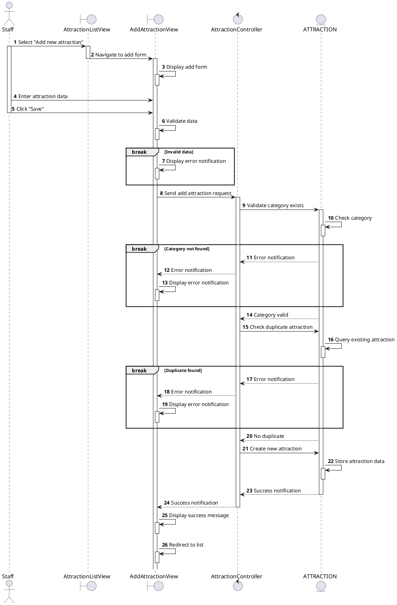

# Sequence Add New Attraction

```plantuml
@startuml
autonumber

actor Staff as S
boundary AttractionListView as ALV
boundary AddAttractionView as AAV
control AttractionController as AC
entity ATTRACTION as ATR

S -> ALV: Select "Add new attraction"
activate S
activate ALV
ALV -> AAV: Navigate to add form
deactivate ALV
activate AAV
AAV -> AAV: Display add form
activate AAV
deactivate AAV

S -> AAV: Enter attraction data
S -> AAV: Click "Save"
deactivate S
AAV -> AAV: Validate data
activate AAV
deactivate AAV

break Invalid data
  AAV -> AAV: Display error notification
  activate AAV
  deactivate AAV
end

AAV -> AC: Send add attraction request
activate AC
AC -> ATR: Validate category exists
activate ATR
ATR -> ATR: Check category
activate ATR
deactivate ATR


break Category not found
  AC <-- ATR: Error notification
  AAV <-- AC: Error notification
  AAV -> AAV: Display error notification
  activate AAV
  deactivate AAV
end

AC <-- ATR: Category valid
AC -> ATR: Check duplicate attraction
ATR -> ATR: Query existing attraction
activate ATR
deactivate ATR


break Duplicate found
  AC <-- ATR: Error notification
  AAV <-- AC: Error notification
  AAV -> AAV: Display error notification
  activate AAV
  deactivate AAV
end

AC <-- ATR: No duplicate
AC -> ATR: Create new attraction
ATR -> ATR: Store attraction data
activate ATR
deactivate ATR
AC <-- ATR: Success notification
deactivate ATR
AAV <-- AC: Success notification
deactivate AC
AAV -> AAV: Display success message
activate AAV
deactivate AAV
AAV -> AAV: Redirect to list
activate AAV
deactivate AAV

@enduml
```

<!-- diagram id="sequence-manage-attraction-add-new-attraction" -->
