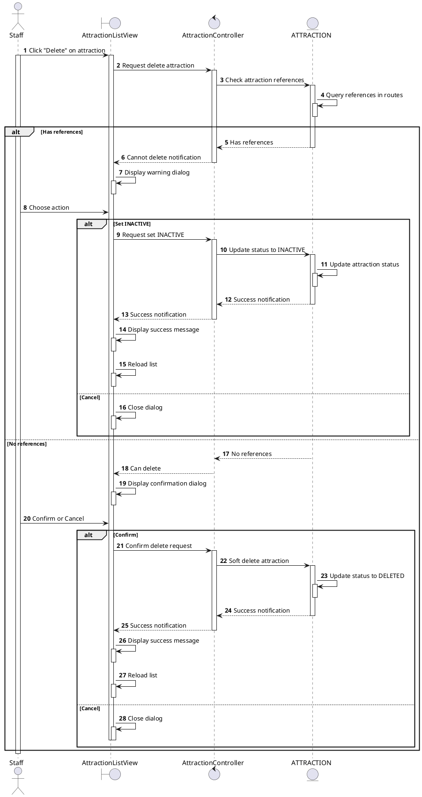

# Sequence Delete Attraction

```plantuml
@startuml
autonumber

actor Staff as S
boundary AttractionListView as ALV
control AttractionController as AC
entity ATTRACTION as ATR

S -> ALV: Click "Delete" on attraction
activate S
activate ALV
ALV -> AC: Request delete attraction
activate AC
AC -> ATR: Check attraction references
activate ATR
ATR -> ATR: Query references in routes
activate ATR
deactivate ATR

alt Has references
  AC <-- ATR: Has references
  deactivate ATR
  ALV <-- AC: Cannot delete notification
  deactivate AC
  ALV -> ALV: Display warning dialog
  activate ALV
  deactivate ALV
  S -> ALV: Choose action

  alt Set INACTIVE
    ALV -> AC: Request set INACTIVE
    activate AC
    AC -> ATR: Update status to INACTIVE
    activate ATR
    ATR -> ATR: Update attraction status
    activate ATR
    deactivate ATR
    AC <-- ATR: Success notification
    deactivate ATR
    ALV <-- AC: Success notification
    deactivate AC
    ALV -> ALV: Display success message
    activate ALV
    deactivate ALV
    ALV -> ALV: Reload list
    activate ALV
    deactivate ALV
  else Cancel
    ALV -> ALV: Close dialog
    activate ALV
    deactivate ALV
  end

else No references
  AC <-- ATR: No references
  deactivate ATR
  ALV <-- AC: Can delete
  deactivate AC
  ALV -> ALV: Display confirmation dialog
  activate ALV
  deactivate ALV
  S -> ALV: Confirm or Cancel

  alt Confirm
    ALV -> AC: Confirm delete request
    activate AC
    AC -> ATR: Soft delete attraction
    activate ATR
    ATR -> ATR: Update status to DELETED
    activate ATR
    deactivate ATR
    AC <-- ATR: Success notification
    deactivate ATR
    ALV <-- AC: Success notification
    deactivate AC
    ALV -> ALV: Display success message
    activate ALV
    deactivate ALV
    ALV -> ALV: Reload list
    activate ALV
    deactivate ALV
  else Cancel
    ALV -> ALV: Close dialog
    activate ALV
    deactivate ALV
    deactivate ALV
  end
end

deactivate ALV
deactivate S

@enduml
```

<!-- diagram id="sequence-manage-attraction-delete-attraction" -->
