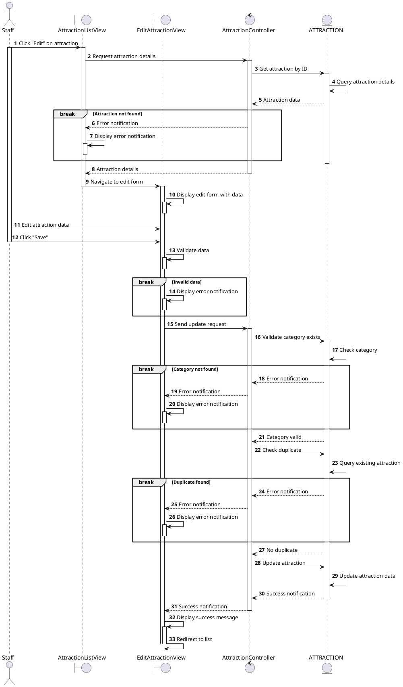

# Sequence Edit Attraction

```plantuml
@startuml
autonumber

actor Staff as S
boundary AttractionListView as ALV
boundary EditAttractionView as EAV
control AttractionController as AC
entity ATTRACTION as ATR

S -> ALV: Click "Edit" on attraction
activate S
activate ALV
ALV -> AC: Request attraction details
activate AC
AC -> ATR: Get attraction by ID
activate ATR
ATR -> ATR: Query attraction details
AC <-- ATR: Attraction data

break Attraction not found
  ALV <-- AC: Error notification
  ALV -> ALV: Display error notification
  activate ALV
  deactivate ALV
end

deactivate ATR
ALV <-- AC: Attraction details
deactivate AC
ALV -> EAV: Navigate to edit form
deactivate ALV
activate EAV
EAV -> EAV: Display edit form with data
activate EAV
deactivate EAV

S -> EAV: Edit attraction data
S -> EAV: Click "Save"
deactivate S
EAV -> EAV: Validate data
activate EAV
deactivate EAV

break Invalid data
  EAV -> EAV: Display error notification
  activate EAV
  deactivate EAV
end

EAV -> AC: Send update request
activate AC
AC -> ATR: Validate category exists
activate ATR
ATR -> ATR: Check category

break Category not found
  AC <-- ATR: Error notification
  EAV <-- AC: Error notification
  EAV -> EAV: Display error notification
  activate EAV
  deactivate EAV
end

AC <-- ATR: Category valid
AC -> ATR: Check duplicate
ATR -> ATR: Query existing attraction

break Duplicate found
  AC <-- ATR: Error notification
  EAV <-- AC: Error notification
  EAV -> EAV: Display error notification
  activate EAV
  deactivate EAV
end

AC <-- ATR: No duplicate
AC -> ATR: Update attraction
ATR -> ATR: Update attraction data
AC <-- ATR: Success notification
deactivate ATR
EAV <-- AC: Success notification
deactivate AC
EAV -> EAV: Display success message
activate EAV
EAV -> EAV: Redirect to list
deactivate EAV
deactivate EAV

@enduml
```

<!-- diagram id="sequence-manage-attraction-edit-attraction-detail" -->
