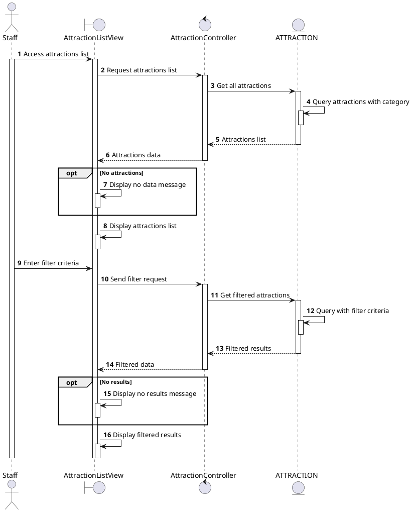

# Sequence View and Filter Attractions

```plantuml
@startuml
autonumber

actor Staff as S
boundary AttractionListView as ALV
control AttractionController as AC
entity ATTRACTION as ATR

S -> ALV: Access attractions list
activate S
activate ALV
ALV -> AC: Request attractions list
activate AC
AC -> ATR: Get all attractions
activate ATR
ATR -> ATR: Query attractions with category
activate ATR
deactivate ATR

AC <-- ATR: Attractions list
deactivate ATR
ALV <-- AC: Attractions data
deactivate AC

opt No attractions
  ALV -> ALV: Display no data message
  activate ALV
  deactivate ALV
end

ALV -> ALV: Display attractions list
activate ALV
deactivate ALV

S -> ALV: Enter filter criteria
ALV -> AC: Send filter request
activate AC
AC -> ATR: Get filtered attractions
activate ATR
ATR -> ATR: Query with filter criteria
activate ATR
deactivate ATR
AC <-- ATR: Filtered results
deactivate ATR
ALV <-- AC: Filtered data
deactivate AC

opt No results
  ALV -> ALV: Display no results message
  activate ALV
  deactivate ALV
end

ALV -> ALV: Display filtered results
activate ALV
deactivate ALV

deactivate ALV
deactivate S

@enduml
```

<!-- diagram id="sequence-manage-attraction-view-and-filter-attractions" -->
