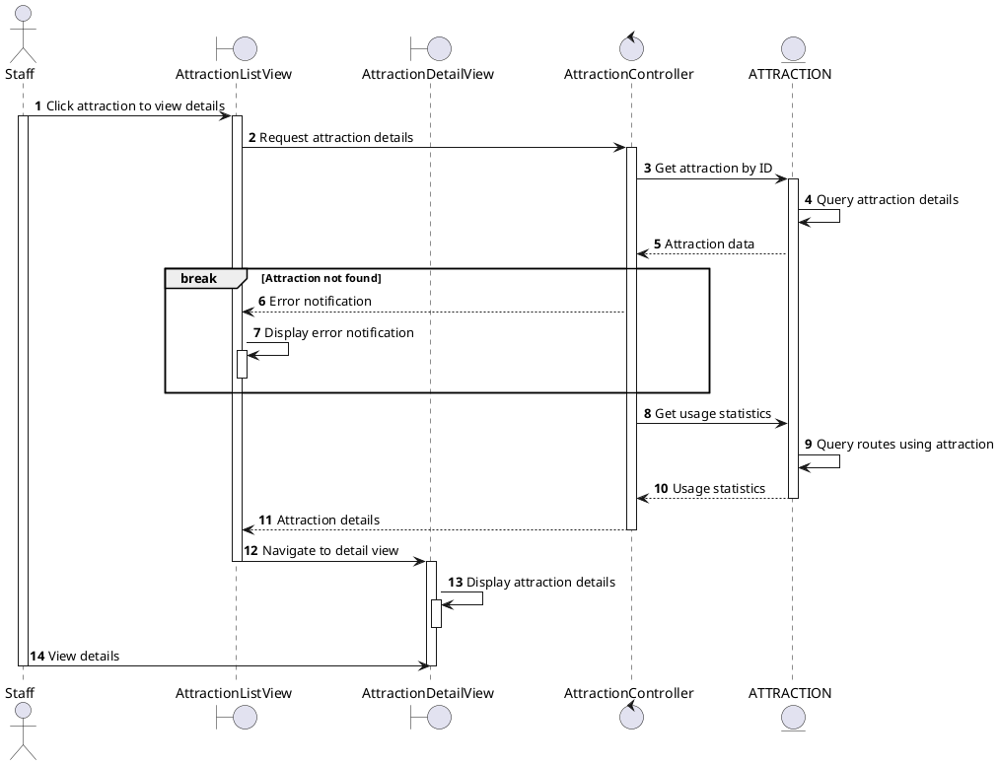

# Sequence View Attraction Detail

```plantuml
@startuml
autonumber

actor Staff as S
boundary AttractionListView as ALV
boundary AttractionDetailView as ADV
control AttractionController as AC
entity ATTRACTION as ATR

S -> ALV: Click attraction to view details
activate S
activate ALV
ALV -> AC: Request attraction details
activate AC
AC -> ATR: Get attraction by ID
activate ATR
ATR -> ATR: Query attraction details
AC <-- ATR: Attraction data

break Attraction not found
  ALV <-- AC: Error notification
  ALV -> ALV: Display error notification
  activate ALV
  deactivate ALV
end

AC -> ATR: Get usage statistics
ATR -> ATR: Query routes using attraction
AC <-- ATR: Usage statistics
deactivate ATR
ALV <-- AC: Attraction details
deactivate AC
ALV -> ADV: Navigate to detail view
deactivate ALV
activate ADV
ADV -> ADV: Display attraction details
activate ADV
deactivate ADV

S -> ADV: View details
deactivate S
deactivate ADV

@enduml
```

<!-- diagram id="sequence-manage-attraction-view-attraction-detail" -->
