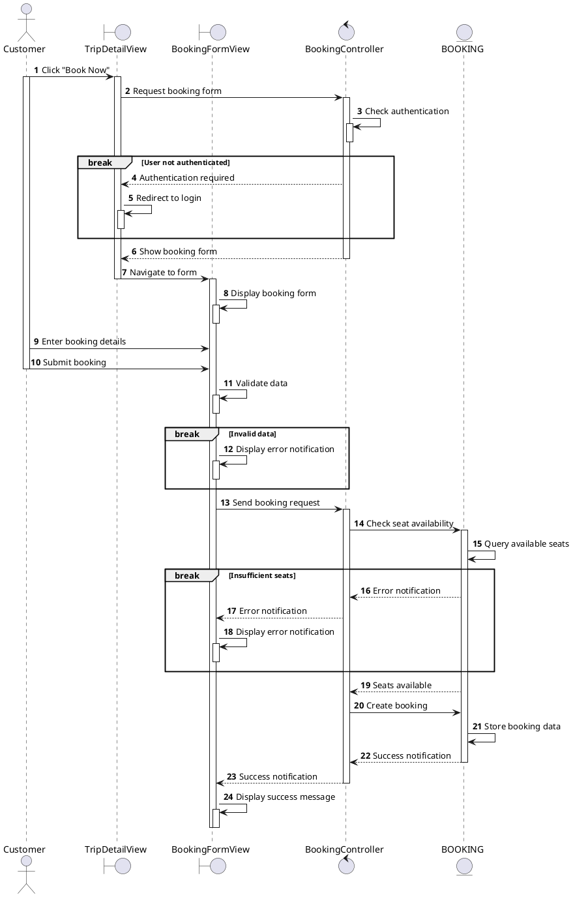

# Sequence Book a Trip

```plantuml
@startuml
autonumber

actor Customer as C
boundary TripDetailView as TDV
boundary BookingFormView as BFV
control BookingController as BC
entity BOOKING as B

C -> TDV: Click "Book Now"
activate C
activate TDV
TDV -> BC: Request booking form
activate BC
BC -> BC: Check authentication
activate BC
deactivate BC

break User not authenticated
  TDV <-- BC: Authentication required
  TDV -> TDV: Redirect to login
  activate TDV
  deactivate TDV
end

TDV <-- BC: Show booking form
deactivate BC
TDV -> BFV: Navigate to form
deactivate TDV
activate BFV
BFV -> BFV: Display booking form
activate BFV
deactivate BFV

C -> BFV: Enter booking details
C -> BFV: Submit booking
deactivate C
BFV -> BFV: Validate data
activate BFV
deactivate BFV

break Invalid data
  BFV -> BFV: Display error notification
  activate BFV
  deactivate BFV
end

BFV -> BC: Send booking request
activate BC
BC -> B: Check seat availability
activate B
B -> B: Query available seats

break Insufficient seats
  BC <-- B: Error notification
  BFV <-- BC: Error notification
  BFV -> BFV: Display error notification
  activate BFV
  deactivate BFV
end

BC <-- B: Seats available
BC -> B: Create booking
B -> B: Store booking data
BC <-- B: Success notification
deactivate B
BFV <-- BC: Success notification
deactivate BC
BFV -> BFV: Display success message
activate BFV
deactivate BFV
deactivate BFV

@enduml
```

<!-- diagram id="sequence-manage-personal-booking-book-a-trip" -->
