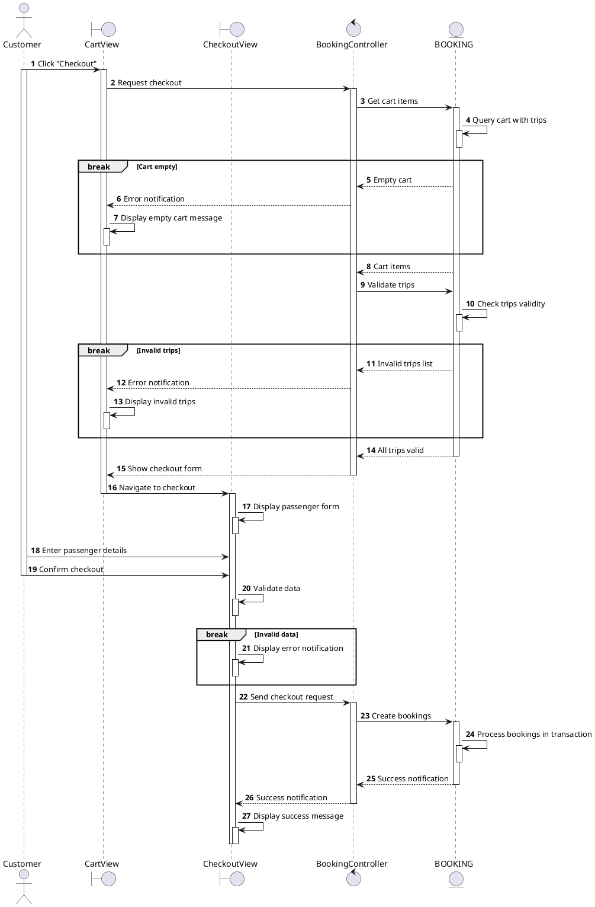

# Sequence Checkout Cart

```plantuml
@startuml
autonumber

actor Customer as C
boundary CartView as CV
boundary CheckoutView as CHV
control BookingController as BC
entity BOOKING as B

C -> CV: Click "Checkout"
activate C
activate CV
CV -> BC: Request checkout
activate BC
BC -> B: Get cart items
activate B
B -> B: Query cart with trips
activate B
deactivate B


break Cart empty
  BC <-- B: Empty cart
  CV <-- BC: Error notification
  CV -> CV: Display empty cart message
  activate CV
  deactivate CV
end

BC <-- B: Cart items
BC -> B: Validate trips
B -> B: Check trips validity
activate B
deactivate B

break Invalid trips
  BC <-- B: Invalid trips list
  CV <-- BC: Error notification
  CV -> CV: Display invalid trips
  activate CV
  deactivate CV
end

BC <-- B: All trips valid
deactivate B
CV <-- BC: Show checkout form
deactivate BC
CV -> CHV: Navigate to checkout
deactivate CV
activate CHV
CHV -> CHV: Display passenger form
activate CHV
deactivate CHV

C -> CHV: Enter passenger details
C -> CHV: Confirm checkout
deactivate C
CHV -> CHV: Validate data
activate CHV
deactivate CHV

break Invalid data
  CHV -> CHV: Display error notification
  activate CHV
  deactivate CHV
end

CHV -> BC: Send checkout request
activate BC
BC -> B: Create bookings
activate B
B -> B: Process bookings in transaction
activate B
deactivate B
BC <-- B: Success notification
deactivate B
CHV <-- BC: Success notification
deactivate BC
CHV -> CHV: Display success message
activate CHV
deactivate CHV
deactivate CHV

@enduml
```

<!-- diagram id="sequence-manage-personal-booking-checkout-cart" -->
