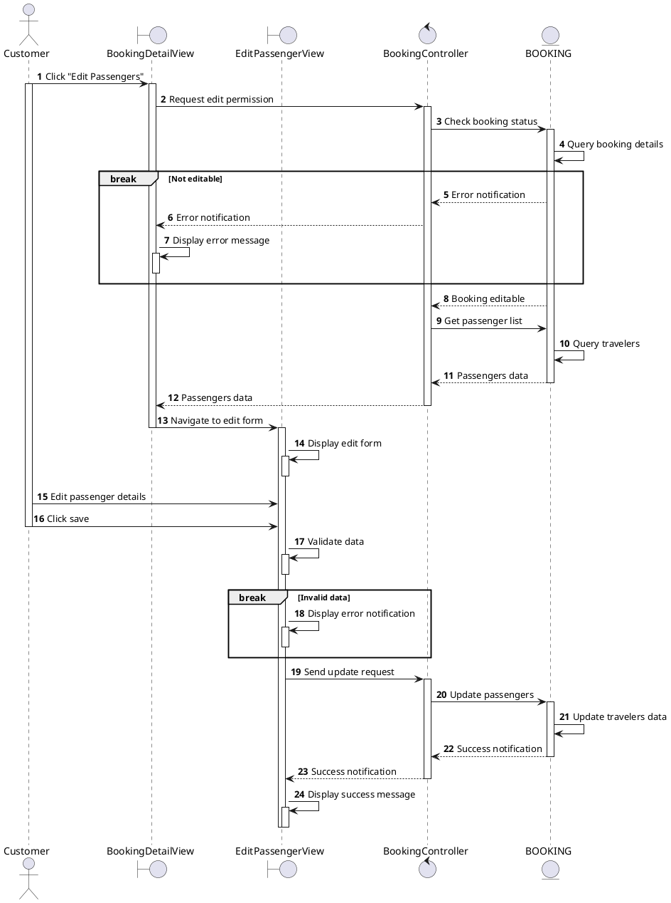

# Sequence Edit Upcoming Trip's Passenger Details

```plantuml
@startuml
autonumber

actor Customer as C
boundary BookingDetailView as BDV
boundary EditPassengerView as EPV
control BookingController as BC
entity BOOKING as B

C -> BDV: Click "Edit Passengers"
activate C
activate BDV
BDV -> BC: Request edit permission
activate BC
BC -> B: Check booking status
activate B
B -> B: Query booking details

break Not editable
  BC <-- B: Error notification
  BDV <-- BC: Error notification
  BDV -> BDV: Display error message
  activate BDV
  deactivate BDV
end

BC <-- B: Booking editable
BC -> B: Get passenger list
B -> B: Query travelers
BC <-- B: Passengers data
deactivate B
BDV <-- BC: Passengers data
deactivate BC
BDV -> EPV: Navigate to edit form
deactivate BDV
activate EPV
EPV -> EPV: Display edit form
activate EPV
deactivate EPV

C -> EPV: Edit passenger details
C -> EPV: Click save
deactivate C
EPV -> EPV: Validate data
activate EPV
deactivate EPV

break Invalid data
  EPV -> EPV: Display error notification
  activate EPV
  deactivate EPV
end

EPV -> BC: Send update request
activate BC
BC -> B: Update passengers
activate B
B -> B: Update travelers data
BC <-- B: Success notification
deactivate B
EPV <-- BC: Success notification
deactivate BC
EPV -> EPV: Display success message
activate EPV
deactivate EPV
deactivate EPV

@enduml
```

<!-- diagram id="sequence-manage-personal-booking-edit-upcoming-trip's-passenger-details" -->
