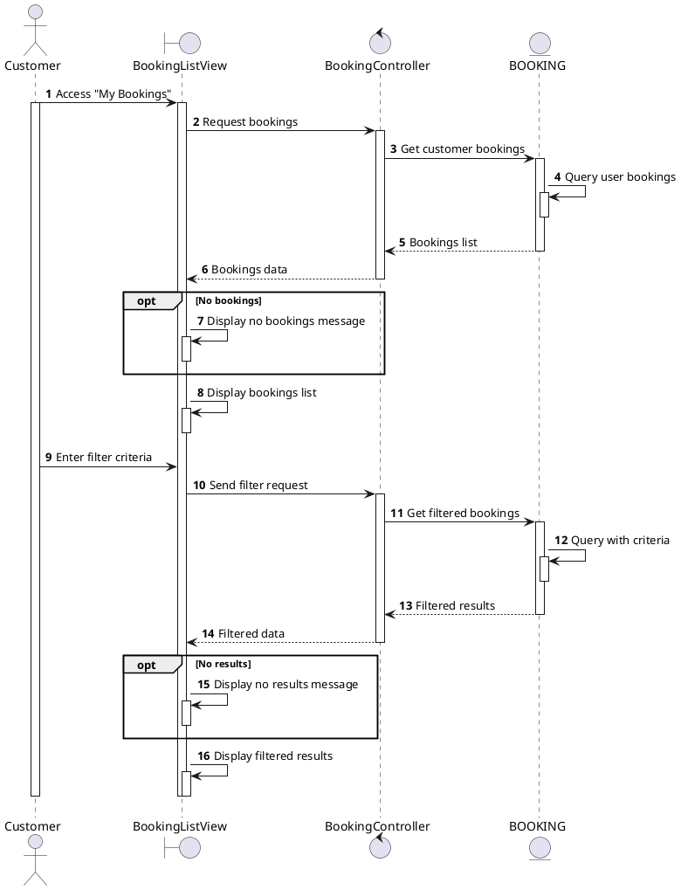

# Sequence View and Filter Personal Bookings

```plantuml
@startuml
autonumber

actor Customer as C
boundary BookingListView as BLV
control BookingController as BC
entity BOOKING as B

C -> BLV: Access "My Bookings"
activate C
activate BLV
BLV -> BC: Request bookings
activate BC
BC -> B: Get customer bookings
activate B
B -> B: Query user bookings
activate B
deactivate B

BC <-- B: Bookings list
deactivate B
BLV <-- BC: Bookings data
deactivate BC

opt No bookings
  BLV -> BLV: Display no bookings message
  activate BLV
  deactivate BLV
end

BLV -> BLV: Display bookings list
activate BLV
deactivate BLV

C -> BLV: Enter filter criteria
BLV -> BC: Send filter request
activate BC
BC -> B: Get filtered bookings
activate B
B -> B: Query with criteria
activate B
deactivate B

BC <-- B: Filtered results
deactivate B
BLV <-- BC: Filtered data
deactivate BC

opt No results
  BLV -> BLV: Display no results message
  activate BLV
  deactivate BLV
end

BLV -> BLV: Display filtered results
activate BLV
deactivate BLV

deactivate BLV
deactivate C

@enduml
```

<!-- diagram id="sequence-manage-personal-booking-view-and-filter-personal-bookings" -->
