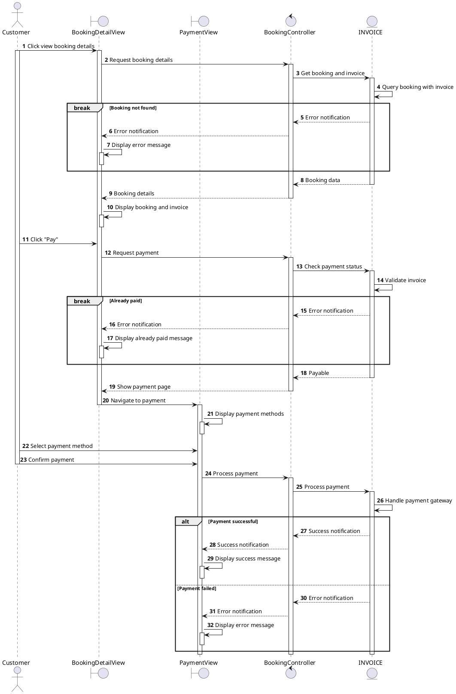

# Sequence View and Pay Booking Invoice Details

```plantuml
@startuml
autonumber

actor Customer as C
boundary BookingDetailView as BDV
boundary PaymentView as PV
control BookingController as BC
entity INVOICE as I

C -> BDV: Click view booking details
activate C
activate BDV
BDV -> BC: Request booking details
activate BC
BC -> I: Get booking and invoice
activate I
I -> I: Query booking with invoice

break Booking not found
  BC <-- I: Error notification
  BDV <-- BC: Error notification
  BDV -> BDV: Display error message
  activate BDV
  deactivate BDV
end

BC <-- I: Booking data
deactivate I
BDV <-- BC: Booking details
deactivate BC
BDV -> BDV: Display booking and invoice
activate BDV
deactivate BDV

C -> BDV: Click "Pay"
BDV -> BC: Request payment
activate BC
BC -> I: Check payment status
activate I
I -> I: Validate invoice

break Already paid
  BC <-- I: Error notification
  BDV <-- BC: Error notification
  BDV -> BDV: Display already paid message
  activate BDV
  deactivate BDV
end

BC <-- I: Payable
deactivate I
BDV <-- BC: Show payment page
deactivate BC
BDV -> PV: Navigate to payment
deactivate BDV
activate PV
PV -> PV: Display payment methods
activate PV
deactivate PV

C -> PV: Select payment method
C -> PV: Confirm payment
deactivate C
PV -> BC: Process payment
activate BC
BC -> I: Process payment
activate I
I -> I: Handle payment gateway

alt Payment successful
  BC <-- I: Success notification
  PV <-- BC: Success notification
  PV -> PV: Display success message
  activate PV
  deactivate PV
else Payment failed
  BC <-- I: Error notification
  PV <-- BC: Error notification
  PV -> PV: Display error message
  activate PV
  deactivate PV
end

deactivate I
deactivate BC
deactivate PV

@enduml
```

<!-- diagram id="sequence-manage-personal-booking-view-and-pay-booking-invoice-details" -->
