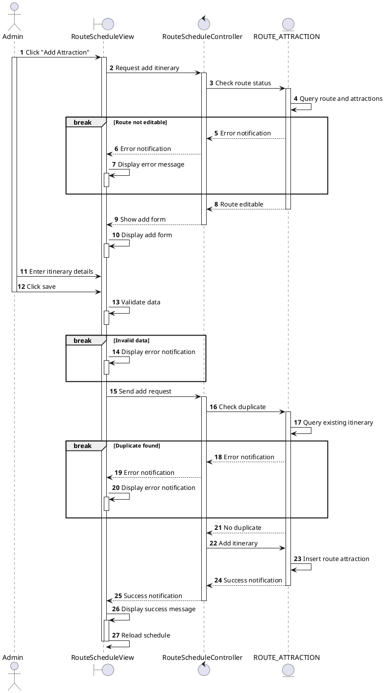

# Sequence Add Itinerary

```plantuml
@startuml
autonumber

actor Admin as A
boundary RouteScheduleView as RSV
control RouteScheduleController as RSC
entity ROUTE_ATTRACTION as RA

A -> RSV: Click "Add Attraction"
activate A
activate RSV
RSV -> RSC: Request add itinerary
activate RSC
RSC -> RA: Check route status
activate RA
RA -> RA: Query route and attractions

break Route not editable
  RSC <-- RA: Error notification
  RSV <-- RSC: Error notification
  RSV -> RSV: Display error message
  activate RSV
  deactivate RSV
end

RSC <-- RA: Route editable
deactivate RA
RSV <-- RSC: Show add form
deactivate RSC
RSV -> RSV: Display add form
activate RSV
deactivate RSV

A -> RSV: Enter itinerary details
A -> RSV: Click save
deactivate A
RSV -> RSV: Validate data
activate RSV
deactivate RSV

break Invalid data
  RSV -> RSV: Display error notification
  activate RSV
  deactivate RSV
end

RSV -> RSC: Send add request
activate RSC
RSC -> RA: Check duplicate
activate RA
RA -> RA: Query existing itinerary

break Duplicate found
  RSC <-- RA: Error notification
  RSV <-- RSC: Error notification
  RSV -> RSV: Display error notification
  activate RSV
  deactivate RSV
end

RSC <-- RA: No duplicate
RSC -> RA: Add itinerary
RA -> RA: Insert route attraction
RSC <-- RA: Success notification
deactivate RA
RSV <-- RSC: Success notification
deactivate RSC
RSV -> RSV: Display success message
activate RSV
RSV -> RSV: Reload schedule
deactivate RSV
deactivate RSV

@enduml
```

<!-- diagram id="sequence-manage-route-schedule-add-itinerary" -->
