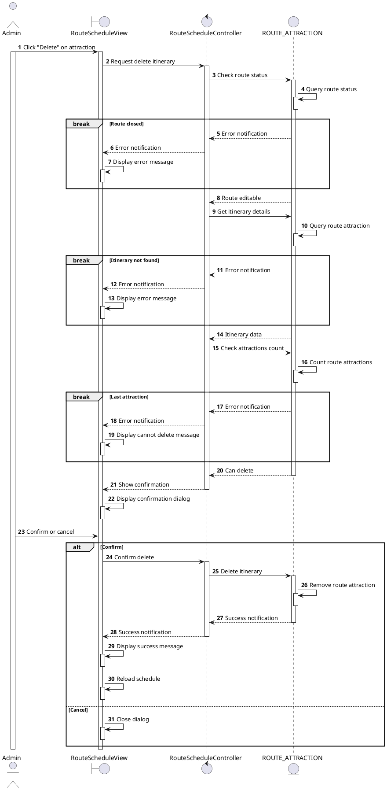

# Sequence Delete Itinerary

```plantuml
@startuml
autonumber

actor Admin as A
boundary RouteScheduleView as RSV
control RouteScheduleController as RSC
entity ROUTE_ATTRACTION as RA

A -> RSV: Click "Delete" on attraction
activate A
activate RSV
RSV -> RSC: Request delete itinerary
activate RSC
RSC -> RA: Check route status
activate RA
RA -> RA: Query route status
activate RA
deactivate RA

break Route closed
  RSC <-- RA: Error notification
  RSV <-- RSC: Error notification
  RSV -> RSV: Display error message
  activate RSV
  deactivate RSV
end

RSC <-- RA: Route editable
RSC -> RA: Get itinerary details
RA -> RA: Query route attraction
activate RA
deactivate RA

break Itinerary not found
  RSC <-- RA: Error notification
  RSV <-- RSC: Error notification
  RSV -> RSV: Display error message
  activate RSV
  deactivate RSV
end

RSC <-- RA: Itinerary data
RSC -> RA: Check attractions count
RA -> RA: Count route attractions
activate RA
deactivate RA


break Last attraction
  RSC <-- RA: Error notification
  RSV <-- RSC: Error notification
  RSV -> RSV: Display cannot delete message
  activate RSV
  deactivate RSV
end

RSC <-- RA: Can delete
deactivate RA
RSV <-- RSC: Show confirmation
deactivate RSC
RSV -> RSV: Display confirmation dialog
activate RSV
deactivate RSV

A -> RSV: Confirm or cancel

alt Confirm
  RSV -> RSC: Confirm delete
  activate RSC
  RSC -> RA: Delete itinerary
  activate RA
  RA -> RA: Remove route attraction
  activate RA
  deactivate RA
  RSC <-- RA: Success notification
  deactivate RA
  RSV <-- RSC: Success notification
  deactivate RSC
  RSV -> RSV: Display success message
  activate RSV
  deactivate RSV
  RSV -> RSV: Reload schedule
  activate RSV
  deactivate RSV
else Cancel
  RSV -> RSV: Close dialog
  activate RSV
  deactivate RSV
end

deactivate RSV
deactivate A

@enduml
```

<!-- diagram id="sequence-manage-route-schedule-delete-itinerary" -->
