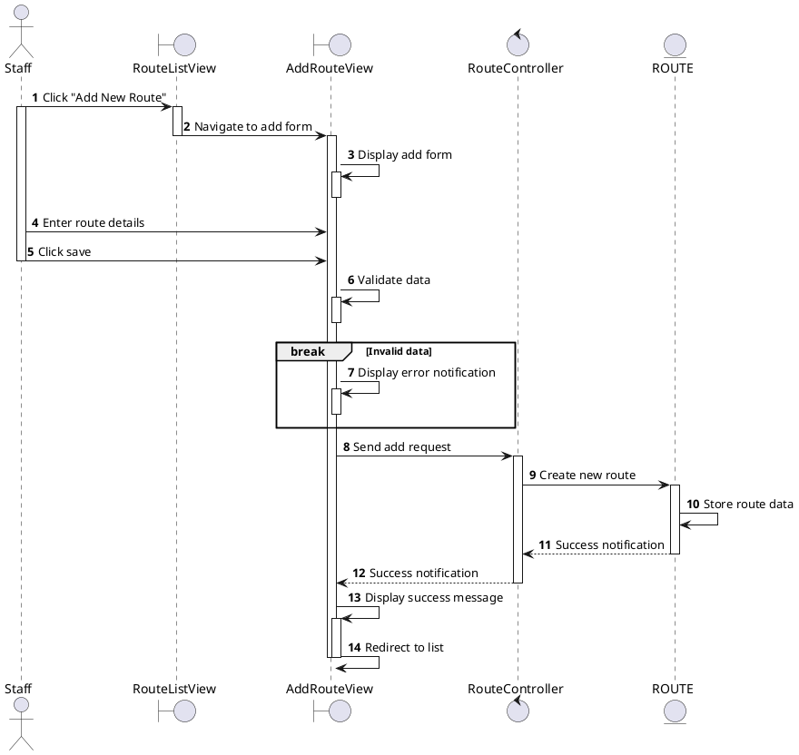

# Sequence Add New Route

```plantuml
@startuml
autonumber

actor Staff as S
boundary RouteListView as RLV
boundary AddRouteView as ARV
control RouteController as RC
entity ROUTE as R

S -> RLV: Click "Add New Route"
activate S
activate RLV
RLV -> ARV: Navigate to add form
deactivate RLV
activate ARV
ARV -> ARV: Display add form
activate ARV
deactivate ARV

S -> ARV: Enter route details
S -> ARV: Click save
deactivate S
ARV -> ARV: Validate data
activate ARV
deactivate ARV

break Invalid data
  ARV -> ARV: Display error notification
  activate ARV
  deactivate ARV
end

ARV -> RC: Send add request
activate RC
RC -> R: Create new route
activate R
R -> R: Store route data
RC <-- R: Success notification
deactivate R
ARV <-- RC: Success notification
deactivate RC
ARV -> ARV: Display success message
activate ARV
ARV -> ARV: Redirect to list
deactivate ARV
deactivate ARV

@enduml
```

<!-- diagram id="sequence-manage-routes-add-new-route" -->
