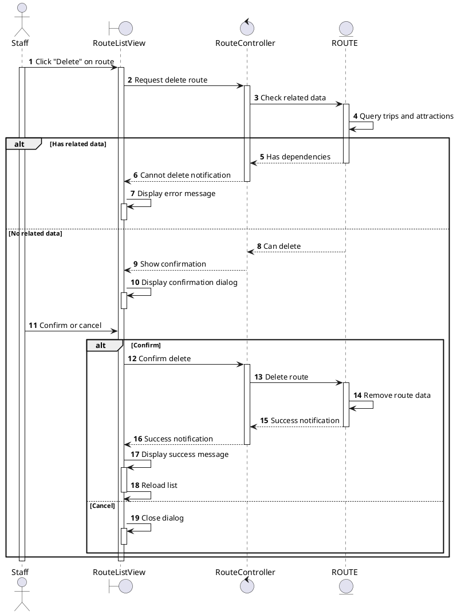

# Sequence Delete Route

```plantuml
@startuml
autonumber

actor Staff as S
boundary RouteListView as RLV
control RouteController as RC
entity ROUTE as R

S -> RLV: Click "Delete" on route
activate S
activate RLV
RLV -> RC: Request delete route
activate RC
RC -> R: Check related data
activate R
R -> R: Query trips and attractions

alt Has related data
  RC <-- R: Has dependencies
  deactivate R
  RLV <-- RC: Cannot delete notification
  deactivate RC
  RLV -> RLV: Display error message
  activate RLV
  deactivate RLV
else No related data
  RC <-- R: Can delete
  deactivate R
  RLV <-- RC: Show confirmation
  deactivate RC
  RLV -> RLV: Display confirmation dialog
  activate RLV
  deactivate RLV

  S -> RLV: Confirm or cancel

  alt Confirm
    RLV -> RC: Confirm delete
    activate RC
    RC -> R: Delete route
    activate R
    R -> R: Remove route data
    RC <-- R: Success notification
    deactivate R
    RLV <-- RC: Success notification
    deactivate RC
    RLV -> RLV: Display success message
    activate RLV
    RLV -> RLV: Reload list
    deactivate RLV
  else Cancel
    RLV -> RLV: Close dialog
    activate RLV
    deactivate RLV
  end
end

deactivate RLV
deactivate S

@enduml
```

<!-- diagram id="sequence-manage-routes-delete-route" -->
