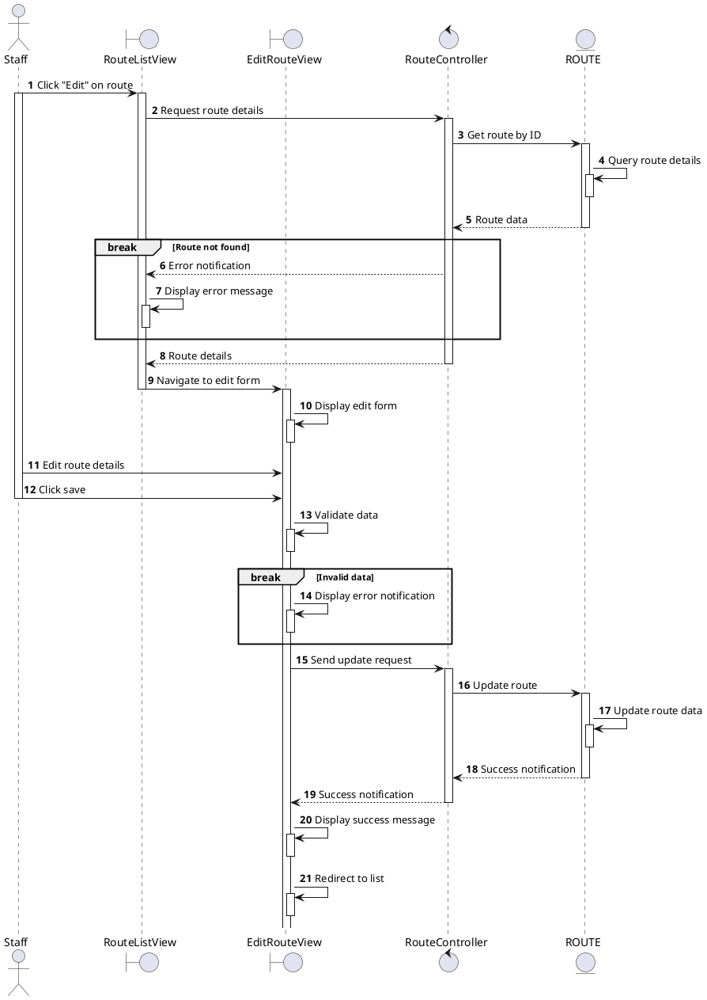

# Sequence Edit Route Details

```plantuml
@startuml
autonumber

actor Staff as S
boundary RouteListView as RLV
boundary EditRouteView as ERV
control RouteController as RC
entity ROUTE as R

S -> RLV: Click "Edit" on route
activate S
activate RLV
RLV -> RC: Request route details
activate RC
RC -> R: Get route by ID
activate R
R -> R: Query route details
activate R
deactivate R
RC <-- R: Route data
deactivate R

break Route not found
  RLV <-- RC: Error notification
  RLV -> RLV: Display error message
  activate RLV
  deactivate RLV
end

deactivate R
RLV <-- RC: Route details
deactivate RC
RLV -> ERV: Navigate to edit form
deactivate RLV
activate ERV
ERV -> ERV: Display edit form
activate ERV
deactivate ERV

S -> ERV: Edit route details
S -> ERV: Click save
deactivate S
ERV -> ERV: Validate data
activate ERV
deactivate ERV

break Invalid data
  ERV -> ERV: Display error notification
  activate ERV
  deactivate ERV
end

ERV -> RC: Send update request
activate RC
RC -> R: Update route
activate R
R -> R: Update route data
activate R
deactivate R
RC <-- R: Success notification
deactivate R
ERV <-- RC: Success notification
deactivate RC
ERV -> ERV: Display success message
activate ERV
deactivate ERV
ERV -> ERV: Redirect to list
activate ERV
deactivate ERV

@enduml
```

<!-- diagram id="sequence-manage-routes-edit-route-details" -->
