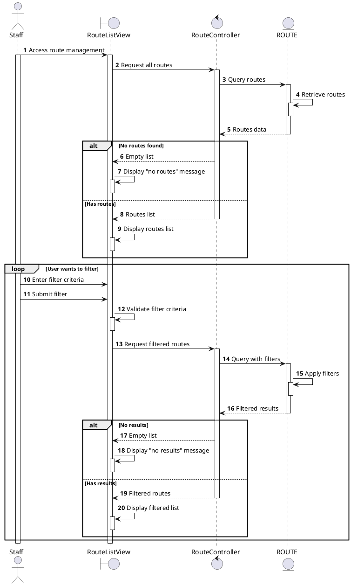

# Sequence View and Filter Routes

```plantuml
@startuml
autonumber

actor Staff as S
boundary RouteListView as RLV
control RouteController as RC
entity ROUTE as R

S -> RLV: Access route management
activate S
activate RLV
RLV -> RC: Request all routes
activate RC
RC -> R: Query routes
activate R
R -> R: Retrieve routes
activate R
deactivate R
RC <-- R: Routes data
deactivate R

alt No routes found
  RLV <-- RC: Empty list
  RLV -> RLV: Display "no routes" message
  activate RLV
  deactivate RLV
else Has routes
  RLV <-- RC: Routes list
  deactivate RC
  RLV -> RLV: Display routes list
  activate RLV
  deactivate RLV
end

loop User wants to filter
  S -> RLV: Enter filter criteria
  S -> RLV: Submit filter
  RLV -> RLV: Validate filter criteria
  activate RLV
  deactivate RLV
  RLV -> RC: Request filtered routes
  activate RC
  RC -> R: Query with filters
  activate R
  R -> R: Apply filters
  activate R
  deactivate R
  RC <-- R: Filtered results
  deactivate R

  alt No results
    RLV <-- RC: Empty list
    RLV -> RLV: Display "no results" message
    activate RLV
    deactivate RLV
  else Has results
    RLV <-- RC: Filtered routes
    deactivate RC
    RLV -> RLV: Display filtered list
    activate RLV
    deactivate RLV
  end
end

deactivate RLV
deactivate S

@enduml

<!-- diagram id="sequence-manage-routes-view-and-filter-routes" -->
```
