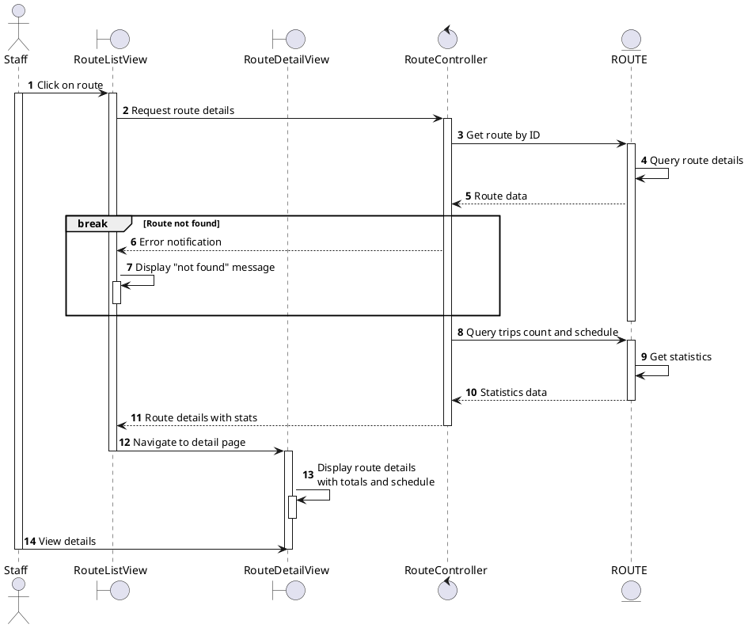

# Sequence View Route Detail

```plantuml
@startuml
autonumber

actor Staff as S
boundary RouteListView as RLV
boundary RouteDetailView as RDV
control RouteController as RC
entity ROUTE as R

S -> RLV: Click on route
activate S
activate RLV
RLV -> RC: Request route details
activate RC
RC -> R: Get route by ID
activate R
R -> R: Query route details
RC <-- R: Route data

break Route not found
  RLV <-- RC: Error notification
  RLV -> RLV: Display "not found" message
  activate RLV
  deactivate RLV
end

deactivate R
RC -> R: Query trips count and schedule
activate R
R -> R: Get statistics
RC <-- R: Statistics data
deactivate R

RLV <-- RC: Route details with stats
deactivate RC
RLV -> RDV: Navigate to detail page
deactivate RLV
activate RDV
RDV -> RDV: Display route details\nwith totals and schedule
activate RDV
deactivate RDV

S -> RDV: View details
deactivate RDV
deactivate S

@enduml

<!-- diagram id="sequence-manage-routes-view-route-detail" -->
```
