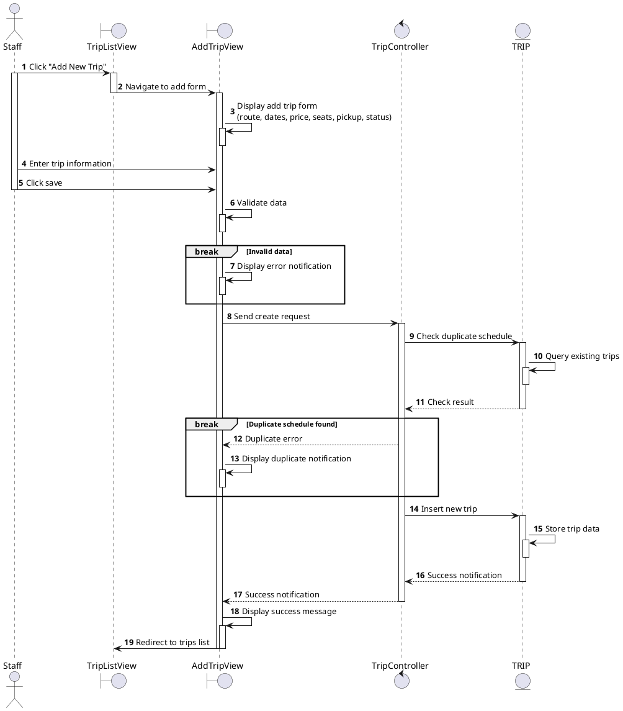

# Sequence Add New Trip

```plantuml
@startuml
autonumber

actor Staff as S
boundary TripListView as TLV
boundary AddTripView as ATV
control TripController as TC
entity TRIP as T

S -> TLV: Click "Add New Trip"
activate S
activate TLV
TLV -> ATV: Navigate to add form
deactivate TLV
activate ATV
ATV -> ATV: Display add trip form\n(route, dates, price, seats, pickup, status)
activate ATV
deactivate ATV

S -> ATV: Enter trip information
S -> ATV: Click save
deactivate S
ATV -> ATV: Validate data
activate ATV
deactivate ATV

break Invalid data
  ATV -> ATV: Display error notification
  activate ATV
  deactivate ATV
end

ATV -> TC: Send create request
activate TC
TC -> T: Check duplicate schedule
activate T
T -> T: Query existing trips
activate T
deactivate T

TC <-- T: Check result
deactivate T

break Duplicate schedule found
  ATV <-- TC: Duplicate error
  ATV -> ATV: Display duplicate notification
  activate ATV
  deactivate ATV
end

deactivate T
TC -> T: Insert new trip
activate T
T -> T: Store trip data
activate T
deactivate T
TC <-- T: Success notification
deactivate T
ATV <-- TC: Success notification
deactivate TC
ATV -> ATV: Display success message
activate ATV
ATV -> TLV: Redirect to trips list
deactivate ATV
deactivate ATV

@enduml

<!-- diagram id="sequence-manage-trips-add-new-trip" -->
```
