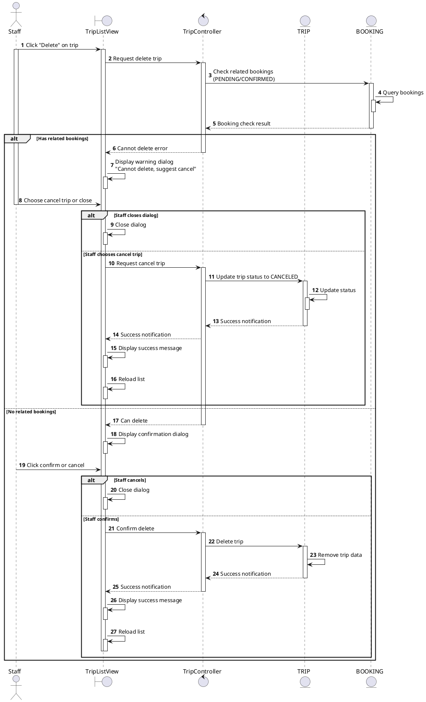

# Sequence Delete Trip

```plantuml
@startuml
autonumber

actor Staff as S
boundary TripListView as TLV
control TripController as TC
entity TRIP as T
entity BOOKING as B

S -> TLV: Click "Delete" on trip
activate S
activate TLV
TLV -> TC: Request delete trip
activate TC
TC -> B: Check related bookings\n(PENDING/CONFIRMED)
activate B
B -> B: Query bookings
activate B
deactivate B
TC <-- B: Booking check result
deactivate B

alt Has related bookings
  TLV <-- TC: Cannot delete error
  deactivate TC
  TLV -> TLV: Display warning dialog\n"Cannot delete, suggest cancel"
  activate TLV
  deactivate TLV

  S -> TLV: Choose cancel trip or close
  deactivate S

  alt Staff closes dialog
    TLV -> TLV: Close dialog
    activate TLV
    deactivate TLV
    deactivate S
  else Staff chooses cancel trip
    TLV -> TC: Request cancel trip
    activate TC
    TC -> T: Update trip status to CANCELED
    activate T
    T -> T: Update status
    activate T
    deactivate T
    TC <-- T: Success notification
    deactivate T
    TLV <-- TC: Success notification
    TLV -> TLV: Display success message
    activate TLV
    deactivate TLV
    TLV -> TLV: Reload list
    activate TLV
    deactivate TLV
    deactivate S
  end

else No related bookings
  TLV <-- TC: Can delete
  deactivate TC
  TLV -> TLV: Display confirmation dialog
  activate TLV
  deactivate TLV

  S -> TLV: Click confirm or cancel

  alt Staff cancels
    TLV -> TLV: Close dialog
    activate TLV
    deactivate TLV
    deactivate S
  else Staff confirms
    TLV -> TC: Confirm delete
    activate TC
    TC -> T: Delete trip
    activate T
    T -> T: Remove trip data
    TC <-- T: Success notification
    deactivate T
    TLV <-- TC: Success notification
    deactivate TC
    TLV -> TLV: Display success message
    activate TLV
    deactivate TLV
    TLV -> TLV: Reload list
    activate TLV
    deactivate TLV
    deactivate TLV
    deactivate S
  end
end

@enduml

<!-- diagram id="sequence-manage-trips-delete-trip" -->
```
