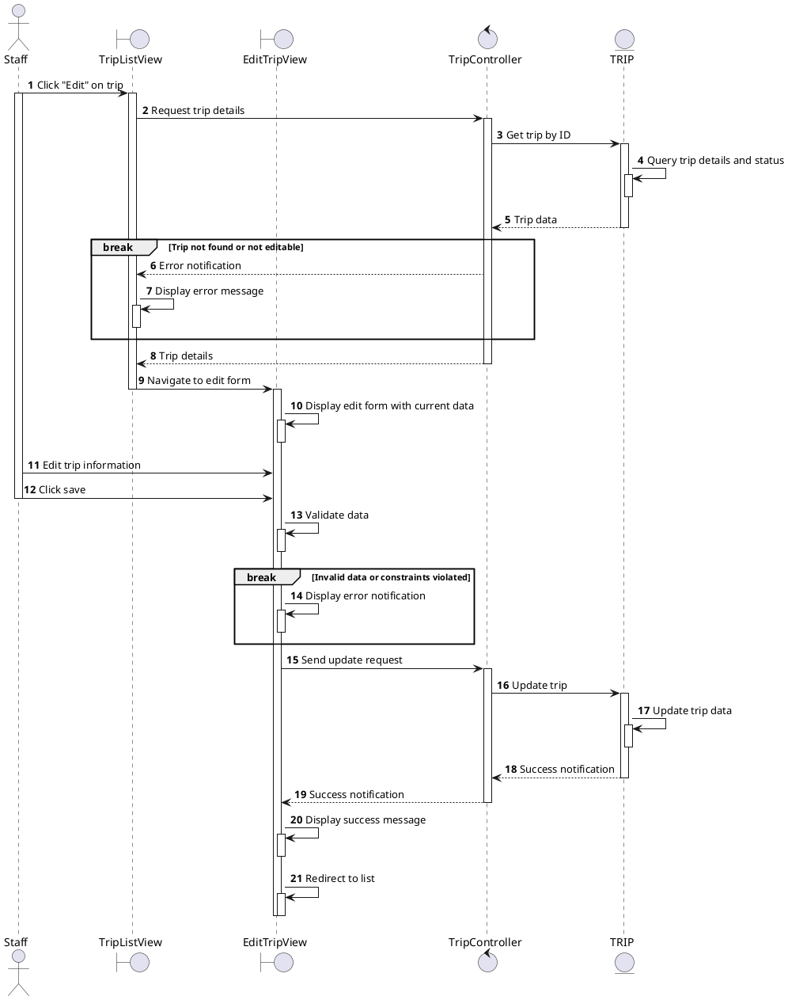

# Sequence Edit Trip

```plantuml
@startuml
autonumber

actor Staff as S
boundary TripListView as TLV
boundary EditTripView as ETV
control TripController as TC
entity TRIP as T

S -> TLV: Click "Edit" on trip
activate S
activate TLV
TLV -> TC: Request trip details
activate TC
TC -> T: Get trip by ID
activate T
T -> T: Query trip details and status
activate T
deactivate T
TC <-- T: Trip data
deactivate T

break Trip not found or not editable
  TLV <-- TC: Error notification
  TLV -> TLV: Display error message
  activate TLV
  deactivate TLV
end

deactivate T
TLV <-- TC: Trip details
deactivate TC
TLV -> ETV: Navigate to edit form
deactivate TLV
activate ETV
ETV -> ETV: Display edit form with current data
activate ETV
deactivate ETV

S -> ETV: Edit trip information
S -> ETV: Click save
deactivate S
ETV -> ETV: Validate data
activate ETV
deactivate ETV

break Invalid data or constraints violated
  ETV -> ETV: Display error notification
  activate ETV
  deactivate ETV
end

ETV -> TC: Send update request
activate TC
TC -> T: Update trip
activate T
T -> T: Update trip data
activate T
deactivate T
TC <-- T: Success notification
deactivate T
ETV <-- TC: Success notification
deactivate TC
ETV -> ETV: Display success message
activate ETV
deactivate ETV
ETV -> ETV: Redirect to list
activate ETV
deactivate ETV
deactivate ETV

@enduml

<!-- diagram id="sequence-manage-trips-edit-trip" -->
```
