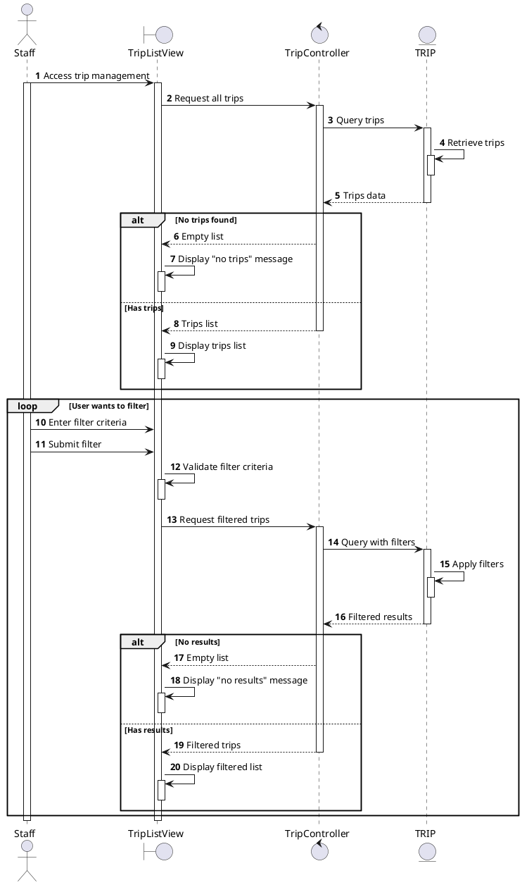

# Sequence View and Filter Trips

```plantuml
@startuml
autonumber

actor Staff as S
boundary TripListView as TLV
control TripController as TC
entity TRIP as T

S -> TLV: Access trip management
activate S
activate TLV
TLV -> TC: Request all trips
activate TC
TC -> T: Query trips
activate T
T -> T: Retrieve trips
activate T
deactivate T
TC <-- T: Trips data
deactivate T

alt No trips found
  TLV <-- TC: Empty list
  TLV -> TLV: Display "no trips" message
  activate TLV
  deactivate TLV
else Has trips
  TLV <-- TC: Trips list
  deactivate TC
  TLV -> TLV: Display trips list
  activate TLV
  deactivate TLV
end

loop User wants to filter
  S -> TLV: Enter filter criteria
  S -> TLV: Submit filter
  TLV -> TLV: Validate filter criteria
  activate TLV
  deactivate TLV
  TLV -> TC: Request filtered trips
  activate TC
  TC -> T: Query with filters
  activate T
  T -> T: Apply filters
  activate T
  deactivate T
  TC <-- T: Filtered results
  deactivate T

  alt No results
    TLV <-- TC: Empty list
    TLV -> TLV: Display "no results" message
    activate TLV
    deactivate TLV
  else Has results
    TLV <-- TC: Filtered trips
    deactivate TC
    TLV -> TLV: Display filtered list
    activate TLV
    deactivate TLV
  end
end

deactivate TLV
deactivate S

@enduml

<!-- diagram id="sequence-manage-trips-view-and-filter-trips" -->
```
