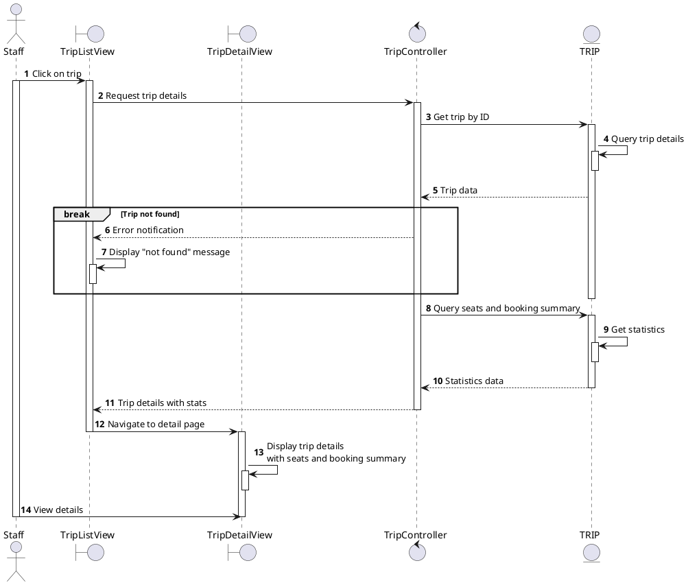

# Sequence View Trip Details

```plantuml
@startuml
autonumber

actor Staff as S
boundary TripListView as TLV
boundary TripDetailView as TDV
control TripController as TC
entity TRIP as T

S -> TLV: Click on trip
activate S
activate TLV
TLV -> TC: Request trip details
activate TC
TC -> T: Get trip by ID
activate T
T -> T: Query trip details
activate T
deactivate T
TC <-- T: Trip data

break Trip not found
  TLV <-- TC: Error notification
  TLV -> TLV: Display "not found" message
  activate TLV
  deactivate TLV
end

deactivate T
TC -> T: Query seats and booking summary
activate T
T -> T: Get statistics
activate T
deactivate T
TC <-- T: Statistics data
deactivate T

TLV <-- TC: Trip details with stats
deactivate TC
TLV -> TDV: Navigate to detail page
deactivate TLV
activate TDV
TDV -> TDV: Display trip details\nwith seats and booking summary
activate TDV
deactivate TDV

S -> TDV: View details
deactivate TDV
deactivate S

@enduml

<!-- diagram id="sequence-manage-trips-view-trip-details" -->
```
